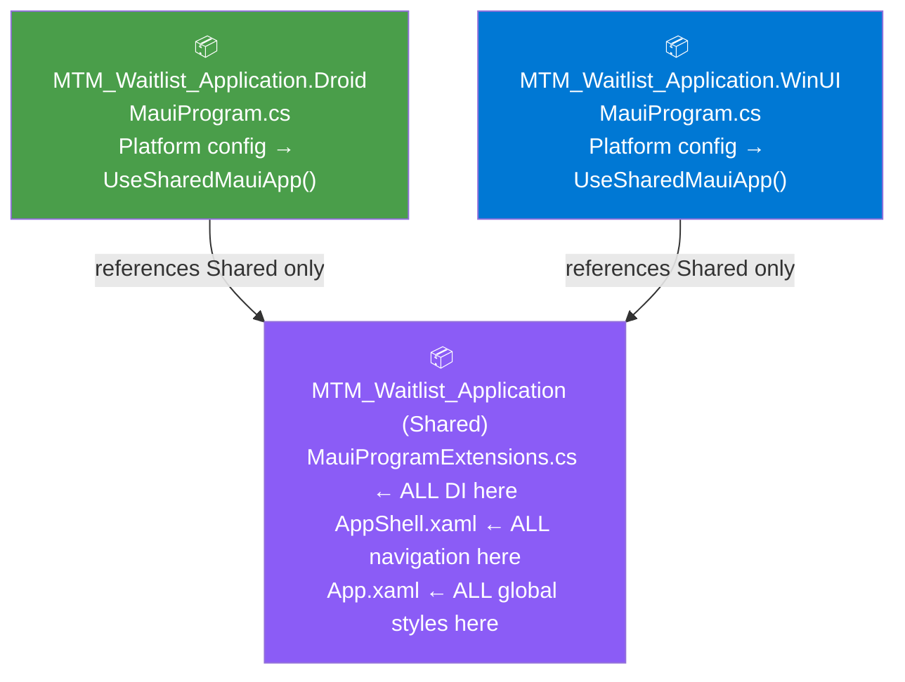
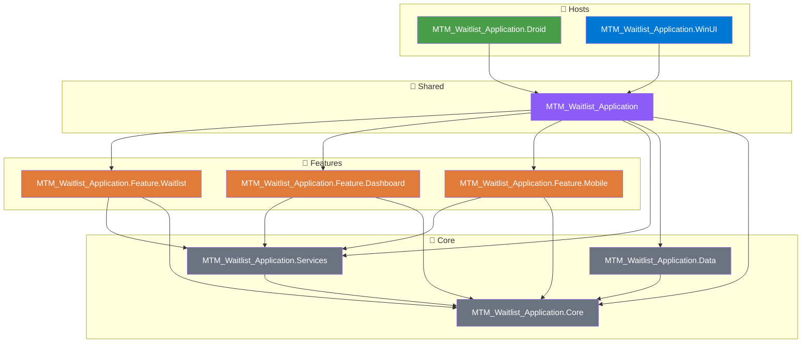
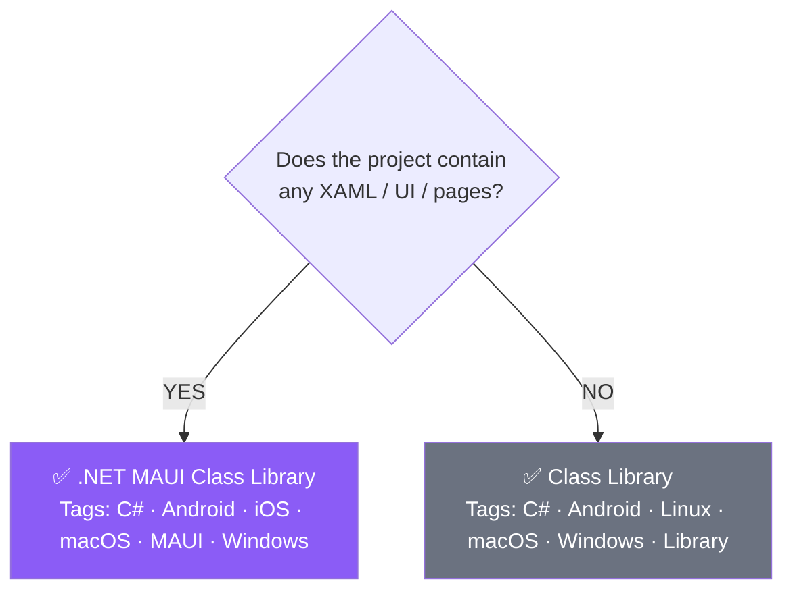
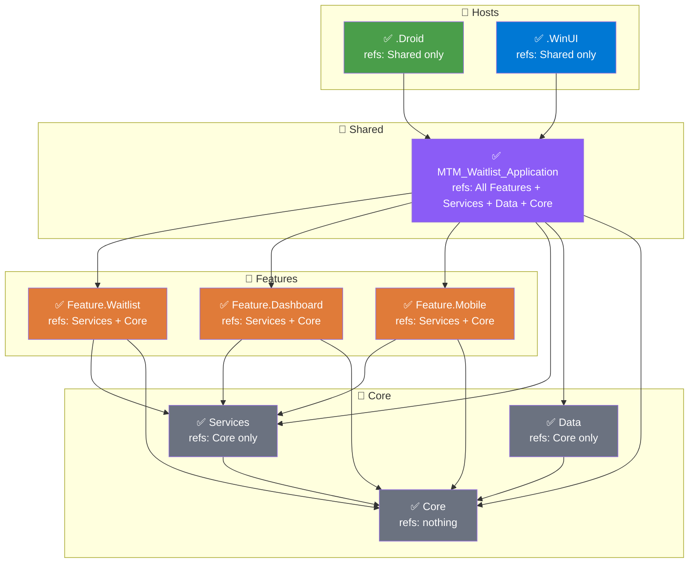

# MTM Waitlist Application — Setup & Architecture Guide

> **Stack:** .NET MAUI · Visual Studio 2026 · GitHub Copilot · C#  
> **Pattern:** Modular multi-project solution (Windows-primary + Android companion)  
> **Solution:** `MTM_Waitlist_Application` (3 of 3 projects scaffolded by VS 2026)

---

## ✅ Prerequisites

- [x] Visual Studio 2026 installed
- [x] `.NET Multi-platform App UI development` workload installed
- [x] GitHub Copilot signed in (`GitHub → Sign in to GitHub Copilot`)
- [x] Android SDK installed (via VS Installer) for mobile emulation
- [x] Solution scaffolded via `.NET MAUI Multi-Project App` template

---

## 📁 Actual Disk Structure (As Scaffolded by VS 2026)

```
C:\Users\johnk\source\repos\MTM_Waitlist_Application\       ← solution root (run all commands from here)
├── .vs\                                                     ← VS 2026 local settings — do not commit
├── MTM_Waitlist_Application.slnx                           ← ⭐ VS 2026 uses .slnx (new format, not .sln)
└── MTM_Waitlist_Application\                               ← subfolder containing all 3 projects
    ├── MTM_Waitlist_Application\                           ← Shared project
    │   ├── Resources\
    │   ├── App.xaml
    │   ├── AppShell.xaml
    │   ├── MainPage.xaml
    │   └── MauiProgramExtensions.cs
    ├── MTM_Waitlist_Application.Droid\                     ← Android host
    │   ├── Assets\
    │   ├── Resources\
    │   ├── AndroidManifest.xml
    │   ├── MainActivity.cs
    │   ├── MainApplication.cs
    │   └── MauiProgram.cs
    └── MTM_Waitlist_Application.WinUI\                     ← Windows host
        ├── Assets\
        ├── Properties\
        ├── app.manifest
        ├── App.xaml
        ├── MauiProgram.cs
        └── Package.appxmanifest
```

> ⚠️ **VS 2026 note:** The solution file is `.slnx` — this is the new VS 2026
> solution format. All `dotnet sln` commands must target
> `MTM_Waitlist_Application.slnx` explicitly.

---

## 🔑 Key Files Explained

| File | Project | Purpose |
|------|---------|---------|
| `MauiProgramExtensions.cs` | Shared | **Single DI registration hub** — registers ALL services, ViewModels, pages, repositories |
| `AppShell.xaml` | Shared | Defines ALL navigation — tabs, flyout, routes |
| `App.xaml` | Shared | Global styles, resource dictionaries, theme |
| `MainPage.xaml` | Shared | Starting page — replace with your own pages |
| `MauiProgram.cs` | Droid | Android startup — platform-specific config then calls `UseSharedMauiApp()` |
| `MauiProgram.cs` | WinUI | Windows startup — platform-specific config then calls `UseSharedMauiApp()` |
| `MainActivity.cs` | Droid | Android lifecycle — do not add business logic here |
| `Package.appxmanifest` | WinUI | Windows identity, capabilities, deployment settings |

---

## 🏗️ Understanding How the 3 Projects Connect



> ⚠️ **The host projects (.Droid and .WinUI) are thin launchers only.**
> Platform-specific startup config goes in each host's `MauiProgram.cs` above
> the `UseSharedMauiApp()` call. Everything shared goes inside `UseSharedMauiApp()`.

---

## 🏗️ Target Modular Architecture



---

## 🔗 Dependency Rules — Read This Before Adding Any Reference

### The Golden Rule
> **Dependency arrows always point DOWN. Nothing lower ever references something higher.**

### Reference Rules Table

| Project | ✅ May Reference | ❌ Must NEVER Reference |
|---------|----------------|------------------------|
| `.Droid` | Shared only | Features, Services, Data, Core directly |
| `.WinUI` | Shared only | Features, Services, Data, Core directly |
| `Shared` | All Features, Services, Data, Core | Host projects (.Droid, .WinUI) |
| `Feature.*` | Services, Core | Data, other Features, Shared, Hosts |
| `Services` | Core | Data, Features, Shared, Hosts |
| `Data` | Core | Services, Features, Shared, Hosts |
| `Core` | Nothing | Everything — zero dependencies |

### Why These Rules Exist

| Rule | Reason |
|------|--------|
| Hosts reference Shared only | Hosts are thin launchers — all wiring is in `MauiProgramExtensions.cs` |
| Features don't reference Data | Repositories are injected via DI — Features never instantiate them directly |
| Features don't reference other Features | Prevents hidden coupling — cross-feature communication goes via Services |
| Core references nothing | Must be 100% portable and independently testable with zero dependencies |
| Services don't reference Data | Services use repository *interfaces* from Core — concrete Data classes are wired in Shared's DI |

---

## 📦 Which Project Template to Use



### Per-Project Template Reference

| Project | Template | Contains UI? | Why |
|---------|----------|:------------:|-----|
| `MTM_Waitlist_Application.Core` | **Class Library** | ❌ | Pure models & interfaces — zero UI, zero MAUI |
| `MTM_Waitlist_Application.Services` | **Class Library** | ❌ | Pure business logic — zero UI, zero MAUI |
| `MTM_Waitlist_Application.Data` | **Class Library** | ❌ | EF Core & repositories — zero UI, zero MAUI |
| `MTM_Waitlist_Application.Feature.Waitlist` | **.NET MAUI Class Library** | ✅ | Contains XAML pages & controls |
| `MTM_Waitlist_Application.Feature.Dashboard` | **.NET MAUI Class Library** | ✅ | Contains XAML pages & controls |
| `MTM_Waitlist_Application.Feature.Mobile` | **.NET MAUI Class Library** | ✅ | Contains XAML pages & controls |

> ⚠️ Using .NET MAUI Class Library for Core/Services/Data pulls in the entire
> MAUI dependency chain, adds bloat, and breaks portability to unit test projects.

---

## 📄 Key File Contents

### MauiProgramExtensions.cs (Shared project)

```csharp
using Microsoft.Extensions.Logging;

namespace MTM_Waitlist_Application
{
    /// <summary>
    /// Extension methods for <see cref="MauiAppBuilder"/> that configure the shared
    /// application setup used by all host projects (WinUI and Droid).
    /// This is the single entry point for fonts, logging, and all DI registration.
    /// Neither host project should register services independently — everything
    /// flows through <see cref="UseSharedMauiApp"/>.
    /// </summary>
    public static class MauiProgramExtensions
    {
        /// <summary>
        /// Configures fonts, logging, and all shared services on the provided builder.
        /// Called by both MauiProgram.cs host files as the sole shared setup method.
        /// Platform-specific config is added in each host's MauiProgram.cs
        /// BEFORE this call.
        /// </summary>
        /// <param name="builder">The <see cref="MauiAppBuilder"/> provided by the host.</param>
        /// <returns>The configured <see cref="MauiAppBuilder"/> for chaining.</returns>
        public static MauiAppBuilder UseSharedMauiApp(this MauiAppBuilder builder)
        {
            builder
                .UseMauiApp<App>()
                .ConfigureFonts(fonts =>
                {
                    fonts.AddFont("OpenSans-Regular.ttf", "OpenSansRegular");
                    fonts.AddFont("OpenSans-Semibold.ttf", "OpenSansSemibold");
                });

#if DEBUG
            builder.Logging.AddDebug();
#endif

            builder.Services.AddSharedServices();

            return builder;
        }
    }

    /// <summary>
    /// Extension methods for <see cref="IServiceCollection"/> that register all
    /// shared application services, repositories, pages, and ViewModels into the
    /// DI container. Uncomment each registration as the corresponding class is created.
    /// This class is internal — only <see cref="MauiProgramExtensions"/> calls it.
    /// </summary>
    internal static class ServiceCollectionExtensions
    {
        /// <summary>
        /// Registers all application dependencies in layered order:
        /// repositories → services → pages → ViewModels.
        /// Add new registrations here as features are built out.
        /// </summary>
        /// <param name="services">The <see cref="IServiceCollection"/> to register into.</param>
        /// <returns>The configured <see cref="IServiceCollection"/> for chaining.</returns>
        public static IServiceCollection AddSharedServices(this IServiceCollection services)
        {
            // ── Repositories (Data layer) ──────────────────────────────
            // Uncomment as concrete repository classes are created in
            // MTM_Waitlist_Application.Data
            // services.AddSingleton<IWaitlistRepository, WaitlistRepository>();

            // ── Services (Business logic layer) ───────────────────────
            // Uncomment as service classes are created in
            // MTM_Waitlist_Application.Services
            // services.AddSingleton<IWaitlistService, WaitlistService>();

            // ── Feature: Waitlist ──────────────────────────────────────
            // Uncomment as pages and ViewModels are created in
            // MTM_Waitlist_Application.Feature.Waitlist
            // services.AddTransient<WaitlistPage>();
            // services.AddTransient<WaitlistViewModel>();

            // ── Feature: Dashboard ─────────────────────────────────────
            // Uncomment as pages and ViewModels are created in
            // MTM_Waitlist_Application.Feature.Dashboard
            // services.AddTransient<DashboardPage>();
            // services.AddTransient<DashboardViewModel>();

            // ── Feature: Mobile ────────────────────────────────────────
            // Uncomment as pages and ViewModels are created in
            // MTM_Waitlist_Application.Feature.Mobile
            // services.AddTransient<MobileHomePage>();
            // services.AddTransient<MobileHomeViewModel>();

            return services;
        }
    }
}
```

---

### MauiProgram.cs — Windows Host

```csharp
namespace MTM_Waitlist_Application.WinUI
{
    /// <summary>
    /// Entry point for the Windows (WinUI) host application.
    /// Responsible for Windows-specific platform configuration only.
    /// All shared setup (fonts, logging, DI) is delegated to
    /// <see cref="MTM_Waitlist_Application.MauiProgramExtensions.UseSharedMauiApp"/>.
    /// </summary>
    public static class MauiProgram
    {
        /// <summary>
        /// Creates and configures the <see cref="MauiApp"/> for the Windows platform.
        /// Add Windows-exclusive configuration above <c>UseSharedMauiApp()</c> only.
        /// </summary>
        /// <returns>A fully configured <see cref="MauiApp"/> instance.</returns>
        public static MauiApp CreateMauiApp()
            => MauiApp.CreateBuilder()
                   // ── Windows-specific configuration only ───────────────
                   // Add anything here that is exclusive to Windows:
                   // e.g. Windows notification services, WinUI theme config,
                   //      desktop file system permissions, tray icon setup
                   // ─────────────────────────────────────────────────────
                   .UseSharedMauiApp()   // ← all shared DI, fonts, logging
                   .Build();
    }
}
```

---

### MauiProgram.cs — Android Host

```csharp
namespace MTM_Waitlist_Application.Droid
{
    /// <summary>
    /// Entry point for the Android (Droid) host application.
    /// Responsible for Android-specific platform configuration only.
    /// All shared setup (fonts, logging, DI) is delegated to
    /// <see cref="MTM_Waitlist_Application.MauiProgramExtensions.UseSharedMauiApp"/>.
    /// </summary>
    public static class MauiProgram
    {
        /// <summary>
        /// Creates and configures the <see cref="MauiApp"/> for the Android platform.
        /// Add Android-exclusive configuration above <c>UseSharedMauiApp()</c> only.
        /// </summary>
        /// <returns>A fully configured <see cref="MauiApp"/> instance.</returns>
        public static MauiApp CreateMauiApp()
            => MauiApp.CreateBuilder()
                   // ── Android-specific configuration only ───────────────
                   // Add anything here that is exclusive to Android:
                   // e.g. push notification setup (FCM), camera/GPS runtime
                   //      permissions, Android-specific SQLite path config,
                   //      biometric authentication handlers
                   // ─────────────────────────────────────────────────────
                   .UseSharedMauiApp()   // ← all shared DI, fonts, logging
                   .Build();
    }
}
```

---

## 🛠️ Step-by-Step: Adding Projects

> 💡 All terminal commands are run from the **solution root**:
> `C:\Users\johnk\source\repos\MTM_Waitlist_Application\`
> Open Terminal in VS 2026: `View → Terminal`

---

### Step 1 — Create Solution Folders & Move Existing Projects

> Solution folders are a Visual Studio UI concept — create them in VS first,
> then use the terminal to re-register projects under them.

**In Visual Studio:**
```
Right-click Solution 'MTM_Waitlist_Application' → Add → New Solution Folder → "Hosts"
Right-click Solution 'MTM_Waitlist_Application' → Add → New Solution Folder → "Shared"
Right-click Solution 'MTM_Waitlist_Application' → Add → New Solution Folder → "Core"
Right-click Solution 'MTM_Waitlist_Application' → Add → New Solution Folder → "Features"
```

**Terminal — move the 3 scaffolded projects into their solution folders:**
```powershell
# Remove existing project registrations from solution root
dotnet sln MTM_Waitlist_Application.slnx remove `
  MTM_Waitlist_Application/MTM_Waitlist_Application/MTM_Waitlist_Application.csproj
dotnet sln MTM_Waitlist_Application.slnx remove `
  MTM_Waitlist_Application/MTM_Waitlist_Application.Droid/MTM_Waitlist_Application.Droid.csproj
dotnet sln MTM_Waitlist_Application.slnx remove `
  MTM_Waitlist_Application/MTM_Waitlist_Application.WinUI/MTM_Waitlist_Application.WinUI.csproj

# Re-add under correct solution folders
dotnet sln MTM_Waitlist_Application.slnx add --solution-folder "Shared" `
  MTM_Waitlist_Application/MTM_Waitlist_Application/MTM_Waitlist_Application.csproj
dotnet sln MTM_Waitlist_Application.slnx add --solution-folder "Hosts" `
  MTM_Waitlist_Application/MTM_Waitlist_Application.Droid/MTM_Waitlist_Application.Droid.csproj
dotnet sln MTM_Waitlist_Application.slnx add --solution-folder "Hosts" `
  MTM_Waitlist_Application/MTM_Waitlist_Application.WinUI/MTM_Waitlist_Application.WinUI.csproj
```

---

### Step 2 — Add Core (Class Library)

**Terminal:**
```powershell
dotnet new classlib -n MTM_Waitlist_Application.Core `
  -o MTM_Waitlist_Application/Core/MTM_Waitlist_Application.Core

dotnet sln MTM_Waitlist_Application.slnx add --solution-folder "Core" `
  MTM_Waitlist_Application/Core/MTM_Waitlist_Application.Core/MTM_Waitlist_Application.Core.csproj
```

> No references to add — Core has zero dependencies.

---

### Step 3 — Add Services (Class Library)

**Terminal:**
```powershell
dotnet new classlib -n MTM_Waitlist_Application.Services `
  -o MTM_Waitlist_Application/Core/MTM_Waitlist_Application.Services

dotnet sln MTM_Waitlist_Application.slnx add --solution-folder "Core" `
  MTM_Waitlist_Application/Core/MTM_Waitlist_Application.Services/MTM_Waitlist_Application.Services.csproj

dotnet add MTM_Waitlist_Application/Core/MTM_Waitlist_Application.Services/MTM_Waitlist_Application.Services.csproj reference `
  MTM_Waitlist_Application/Core/MTM_Waitlist_Application.Core/MTM_Waitlist_Application.Core.csproj
```

---

### Step 4 — Add Data (Class Library)

**Terminal:**
```powershell
dotnet new classlib -n MTM_Waitlist_Application.Data `
  -o MTM_Waitlist_Application/Core/MTM_Waitlist_Application.Data

dotnet sln MTM_Waitlist_Application.slnx add --solution-folder "Core" `
  MTM_Waitlist_Application/Core/MTM_Waitlist_Application.Data/MTM_Waitlist_Application.Data.csproj

dotnet add MTM_Waitlist_Application/Core/MTM_Waitlist_Application.Data/MTM_Waitlist_Application.Data.csproj reference `
  MTM_Waitlist_Application/Core/MTM_Waitlist_Application.Core/MTM_Waitlist_Application.Core.csproj
```

---

### Step 5 — Add Feature Modules (MAUI Class Library)

**Terminal:**
```powershell
# ── Feature: Waitlist ──────────────────────────────────────────────
dotnet new mauilib -n MTM_Waitlist_Application.Feature.Waitlist `
  -o MTM_Waitlist_Application/Features/MTM_Waitlist_Application.Feature.Waitlist

dotnet sln MTM_Waitlist_Application.slnx add --solution-folder "Features" `
  MTM_Waitlist_Application/Features/MTM_Waitlist_Application.Feature.Waitlist/MTM_Waitlist_Application.Feature.Waitlist.csproj

dotnet add MTM_Waitlist_Application/Features/MTM_Waitlist_Application.Feature.Waitlist/MTM_Waitlist_Application.Feature.Waitlist.csproj reference `
  MTM_Waitlist_Application/Core/MTM_Waitlist_Application.Core/MTM_Waitlist_Application.Core.csproj `
  MTM_Waitlist_Application/Core/MTM_Waitlist_Application.Services/MTM_Waitlist_Application.Services.csproj

# ── Feature: Dashboard ─────────────────────────────────────────────
dotnet new mauilib -n MTM_Waitlist_Application.Feature.Dashboard `
  -o MTM_Waitlist_Application/Features/MTM_Waitlist_Application.Feature.Dashboard

dotnet sln MTM_Waitlist_Application.slnx add --solution-folder "Features" `
  MTM_Waitlist_Application/Features/MTM_Waitlist_Application.Feature.Dashboard/MTM_Waitlist_Application.Feature.Dashboard.csproj

dotnet add MTM_Waitlist_Application/Features/MTM_Waitlist_Application.Feature.Dashboard/MTM_Waitlist_Application.Feature.Dashboard.csproj reference `
  MTM_Waitlist_Application/Core/MTM_Waitlist_Application.Core/MTM_Waitlist_Application.Core.csproj `
  MTM_Waitlist_Application/Core/MTM_Waitlist_Application.Services/MTM_Waitlist_Application.Services.csproj

# ── Feature: Mobile ────────────────────────────────────────────────
dotnet new mauilib -n MTM_Waitlist_Application.Feature.Mobile `
  -o MTM_Waitlist_Application/Features/MTM_Waitlist_Application.Feature.Mobile

dotnet sln MTM_Waitlist_Application.slnx add --solution-folder "Features" `
  MTM_Waitlist_Application/Features/MTM_Waitlist_Application.Feature.Mobile/MTM_Waitlist_Application.Feature.Mobile.csproj

dotnet add MTM_Waitlist_Application/Features/MTM_Waitlist_Application.Feature.Mobile/MTM_Waitlist_Application.Feature.Mobile.csproj reference `
  MTM_Waitlist_Application/Core/MTM_Waitlist_Application.Core/MTM_Waitlist_Application.Core.csproj `
  MTM_Waitlist_Application/Core/MTM_Waitlist_Application.Services/MTM_Waitlist_Application.Services.csproj
```

> ❌ **Do NOT add a reference to Data in any Feature project.**
> Repositories are injected via DI — Features never instantiate them directly.

---

### Step 6 — Wire Up the Shared Project

The Shared project is the DI hub — it must reference everything so
`MauiProgramExtensions.cs` can register it all in `AddSharedServices()`.

**Terminal:**
```powershell
dotnet add MTM_Waitlist_Application/MTM_Waitlist_Application/MTM_Waitlist_Application.csproj reference `
  MTM_Waitlist_Application/Core/MTM_Waitlist_Application.Core/MTM_Waitlist_Application.Core.csproj `
  MTM_Waitlist_Application/Core/MTM_Waitlist_Application.Services/MTM_Waitlist_Application.Services.csproj `
  MTM_Waitlist_Application/Core/MTM_Waitlist_Application.Data/MTM_Waitlist_Application.Data.csproj `
  MTM_Waitlist_Application/Features/MTM_Waitlist_Application.Feature.Waitlist/MTM_Waitlist_Application.Feature.Waitlist.csproj `
  MTM_Waitlist_Application/Features/MTM_Waitlist_Application.Feature.Dashboard/MTM_Waitlist_Application.Feature.Dashboard.csproj `
  MTM_Waitlist_Application/Features/MTM_Waitlist_Application.Feature.Mobile/MTM_Waitlist_Application.Feature.Mobile.csproj
```

> ⚠️ The Shared project references Data here (and nowhere else) purely so
> that `AddSharedServices()` can register concrete repository implementations
> against their interfaces from Core.

---

### Step 7 — Verify Host Projects Reference Shared Only

**Terminal:**
```powershell
# Both commands should show ONLY the Shared project reference
dotnet list MTM_Waitlist_Application/MTM_Waitlist_Application.Droid/MTM_Waitlist_Application.Droid.csproj reference
dotnet list MTM_Waitlist_Application/MTM_Waitlist_Application.WinUI/MTM_Waitlist_Application.WinUI.csproj reference
```

**Expected output for both:**
```
Project reference(s)
────────────────────────────────────────────────────────────────────
..\MTM_Waitlist_Application\MTM_Waitlist_Application.csproj
```

If any other references appear, remove them:
```powershell
# Example: remove an incorrect direct Core reference from the Droid host
dotnet remove MTM_Waitlist_Application/MTM_Waitlist_Application.Droid/MTM_Waitlist_Application.Droid.csproj reference `
  MTM_Waitlist_Application/Core/MTM_Waitlist_Application.Core/MTM_Waitlist_Application.Core.csproj
```

---

### Step 8 — Update Key Files

No terminal commands for this step. Open each file in VS 2026 and replace
with the contents shown in the **📄 Key File Contents** section above.

| File | Location | Action |
|------|----------|--------|
| `MauiProgramExtensions.cs` | Shared project | Replace with full version — adds `AddSharedServices()` |
| `MauiProgram.cs` | WinUI project | Replace with annotated version |
| `MauiProgram.cs` | Droid project | Replace with annotated version (namespace changes to `.Droid`) |

> 💡 **Rule of thumb:** If a registration would apply to both platforms → it goes
> in `AddSharedServices()`. If it is exclusive to one platform → it goes in that
> host's `MauiProgram.cs` above the `UseSharedMauiApp()` call.

---

## ✅ Final Verification — Build the Entire Solution

**Terminal:**
```powershell
# Build everything — all projects must succeed with 0 errors
dotnet build MTM_Waitlist_Application.slnx

# Confirm references on key projects
dotnet list MTM_Waitlist_Application/MTM_Waitlist_Application/MTM_Waitlist_Application.csproj reference
dotnet list MTM_Waitlist_Application/Core/MTM_Waitlist_Application.Services/MTM_Waitlist_Application.Services.csproj reference
dotnet list MTM_Waitlist_Application/Core/MTM_Waitlist_Application.Data/MTM_Waitlist_Application.Data.csproj reference
dotnet list MTM_Waitlist_Application/Features/MTM_Waitlist_Application.Feature.Waitlist/MTM_Waitlist_Application.Feature.Waitlist.csproj reference
```

**Expected build output:**
```
Build succeeded.
    0 Error(s)
    0 Warning(s)
```

---

## ✅ Final Solution Structure Checklist



---

## ▶️ Running the App

### Windows
```powershell
dotnet build MTM_Waitlist_Application/MTM_Waitlist_Application.WinUI/MTM_Waitlist_Application.WinUI.csproj
```
Or in VS 2026:
```
Set startup project → MTM_Waitlist_Application.WinUI → Windows Machine → F5
```

### Android
```powershell
dotnet build -t:Run -f net10.0-android `
  MTM_Waitlist_Application/MTM_Waitlist_Application.Droid/MTM_Waitlist_Application.Droid.csproj
```
Or in VS 2026:
```
Set startup project → MTM_Waitlist_Application.Droid → Android Emulator → F5
```

---

## 🤖 GitHub Copilot Tips (VS 2026)

| Action | How |
|--------|-----|
| Open Copilot Chat | `View → GitHub Copilot Chat` |
| Explain a file | Select code → `/explain` |
| Generate unit tests | Select a service class → `/tests` |
| Scaffold a ViewModel | Ask: *"Create an MVVM ViewModel for a waitlist page"* |
| Fix a bug | Highlight error → `/fix` |
| Document a method | Select a method → `/doc` |

> Copilot is built-in to VS 2026 — no extension needed.
> Sign in via `GitHub → Sign in to GitHub Copilot`

---

## 📐 UI Design Differences

See **`docs\ApplicationSetup\UI-DESIGN-DIFFERENCES.md`** for a full breakdown of how Windows and
Android UI coding differs in MAUI.

---

## 📚 Resources

- [.NET MAUI Docs](https://learn.microsoft.com/en-us/dotnet/maui/)
- [MAUI Community Toolkit](https://github.com/CommunityToolkit/Maui)
- [MVVM Community Toolkit](https://github.com/CommunityToolkit/dotnet)
- [.NET MAUI Samples](https://github.com/dotnet/maui-samples)
- [VS 2026 Release Notes](https://learn.microsoft.com/en-us/visualstudio/releases/2026/release-notes)
- [AppShell Navigation](https://learn.microsoft.com/en-us/dotnet/maui/fundamentals/shell/)
- [MAUI Layouts](https://learn.microsoft.com/en-us/dotnet/maui/user-interface/layouts/)
- [Dependency Injection in MAUI](https://learn.microsoft.com/en-us/dotnet/maui/fundamentals/dependency-injection)
- [dotnet CLI reference](https://learn.microsoft.com/en-us/dotnet/core/tools/)