# Server Admin Startup Splash Flow

This document captures the planned startup flow for the server admin app before implementation.
It is the source of truth for what was discovered, what was changed, and what needs to be built.

## Scope

- Server admin only for the first rollout.
- The diagrams reflect the planned splash-first startup flow.
- Nodes marked as changed behavior indicate places where the new splash flow intentionally differs from the current startup path.

## Startup UX Rules

- The splash screen opens first and stays visible while startup work runs.
- The splash shows every major startup step with friendly status text.
- Technical details stay in logs or an expandable diagnostics area, never inline in the main UI.
- The user can cancel startup at any time; cancel must run cleanup, trigger garbage collection, and exit.
- The main server window opens only after startup completes cleanly.
- When an existing degraded-mode rule allows the degraded main window, the splash routes into it instead of blocking.
- Existing degraded-mode decision rules remain authoritative — the splash is a presentation layer, not a new decision layer.

## Code Changes Already Applied (Pre-Implementation)

Two bugs found during edge case analysis were fixed in `App.xaml.cs` before splash work begins:

### Fix 1 — `neverConfigured=true` + `probe=Ready` now bypasses the wizard

**Before:** When `UpdaterPassword` was empty (`neverConfigured=true`) the wizard opened unconditionally regardless of probe status, including when the probe returned `Ready`.

**After:** If `neverConfigured=true` but `probeResult.Status == FirstRunStatus.Ready`, the wizard is skipped and startup falls through to the Windows auth gate. The DB is clearly accessible; credentials are simply missing from the settings file (anonymous MySQL connection or adopted existing DB).

**Affected file:** `Hosts/MTM_Waitlist_Server.Admin/App.xaml.cs` — the `if (neverConfigured)` block.

### Fix 2 — Self-heal `MarkCompleteAsync()` write wrapped in `try/catch`

**Before:** When the probe returned `Ready` but `FirstRunComplete=false`, the self-heal path called `MarkCompleteAsync()` via `Task.Run(...).GetAwaiter().GetResult()` with no exception handling. A write failure (disk full, read-only `%ProgramData%`, file locked) would propagate uncaught out of `OnLaunched()`, crashing the app before any window appeared.

**After:** The write is wrapped in `try/catch`. Failure is logged as a non-fatal warning and startup continues to normal launch. The self-heal will succeed on the next launch once the file becomes writable.

**Affected file:** `Hosts/MTM_Waitlist_Server.Admin/App.xaml.cs` — the self-heal block inside the Ready path.

## Mapped Edge Cases

These edge cases were discovered during diagram review and are now documented in the diagrams below.
The two fixes above addressed the actionable ones; the remaining two are documentation-only.

| # | Edge Case | Impact | Mitigation |
|---|-----------|--------|------------|
| 1 | `server-settings.json` corrupt or unreadable | `LoadFromDisk()` silently returns defaults; `UpdaterPassword` is empty; wizard re-runs on existing install; all prior settings lost | Restore backup or recreate file manually; Diagram 1 warning node added |
| 2 | MySQL drops between probe completing and `IsAuthorisedAsync()` running | `IsAuthorisedAsync` has a blanket `catch { return false; }` — user sees Access Denied instead of Database Unreachable; root cause invisible without log | No code change; log is the only diagnostic; Diagram 3 warning node added |
| 3 | `MarkCompleteAsync()` write failure during self-heal | **Fixed** — was a silent crash; now try/catch with non-fatal warning log |
| 4 | `neverConfigured=true` + `probe=Ready` | **Fixed** — was opening wizard unnecessarily; now bypasses to Windows auth |

## Planned Startup Flow

The full workflow is easier to review when broken into smaller chunks.

### 1. Startup Sequence

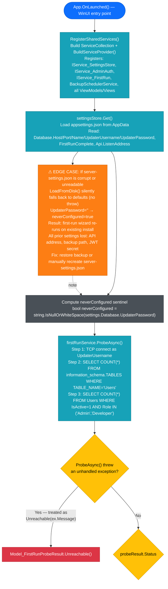

### 2. Probe Outcome Routing

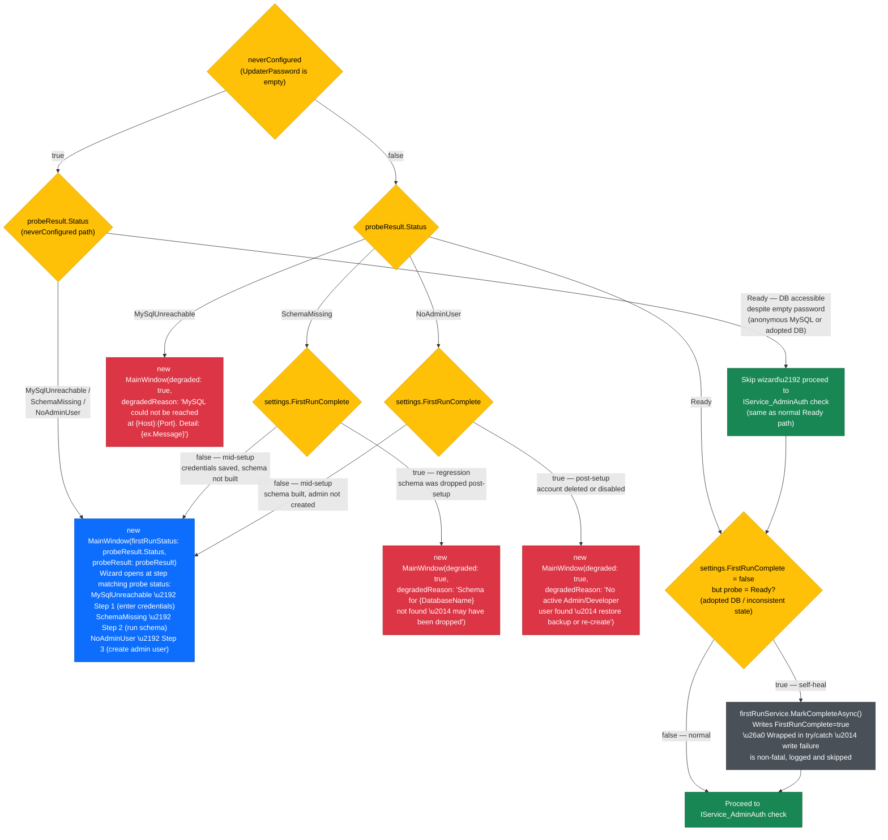

### 3. Ready Path

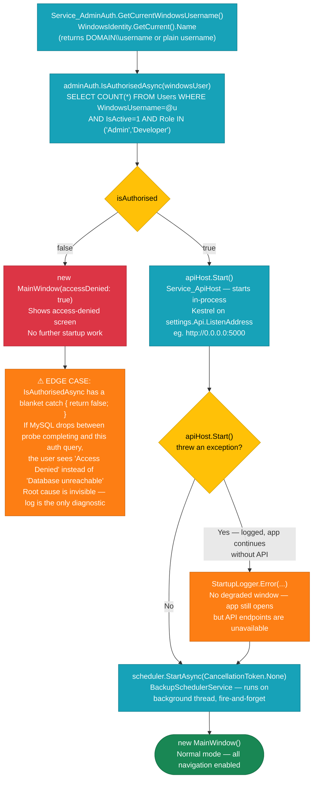

### 4. User Choice Routes For Issue States

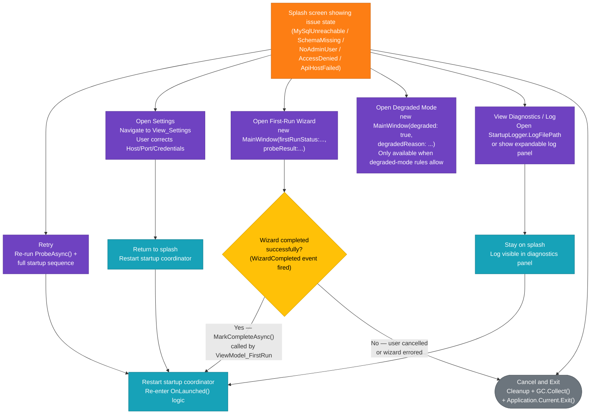

### 5. Failure Mapping Reference

**MySQL unreachable — first setup** *(neverConfigured=true, probe threw MySqlException network error)*
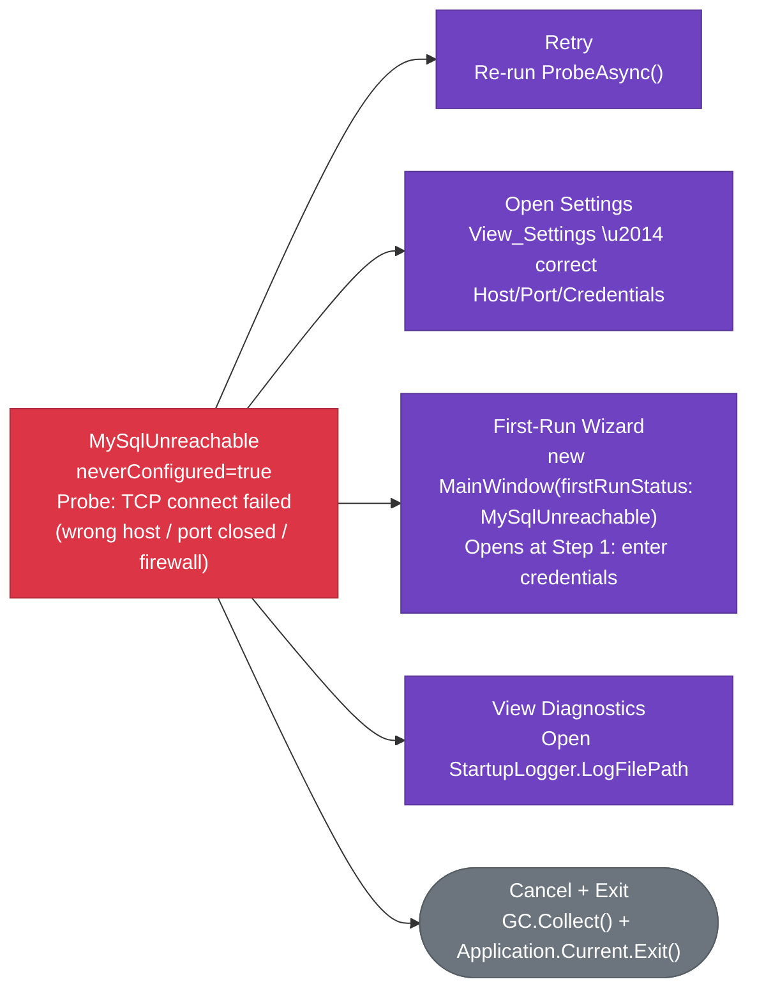

**MySQL unreachable — known host** *(neverConfigured=false, credentials exist but DB is down)*
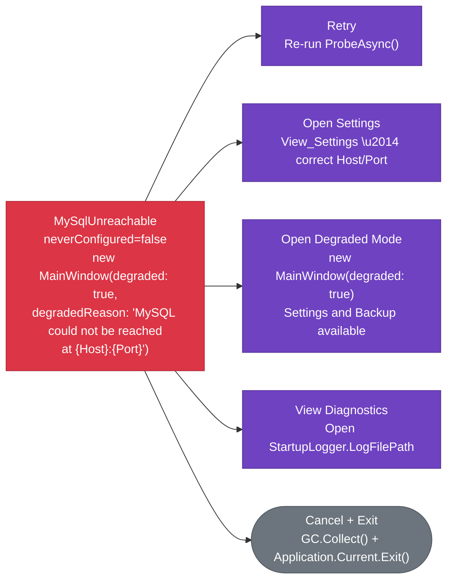

**Schema missing — during setup** *(SchemaMissing + FirstRunComplete=false)*
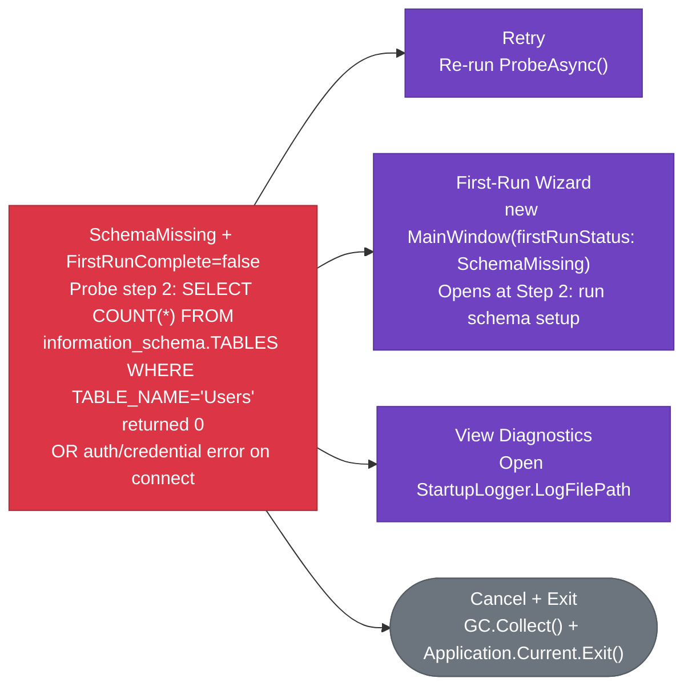

**Schema missing — post setup** *(SchemaMissing + FirstRunComplete=true — regression)*
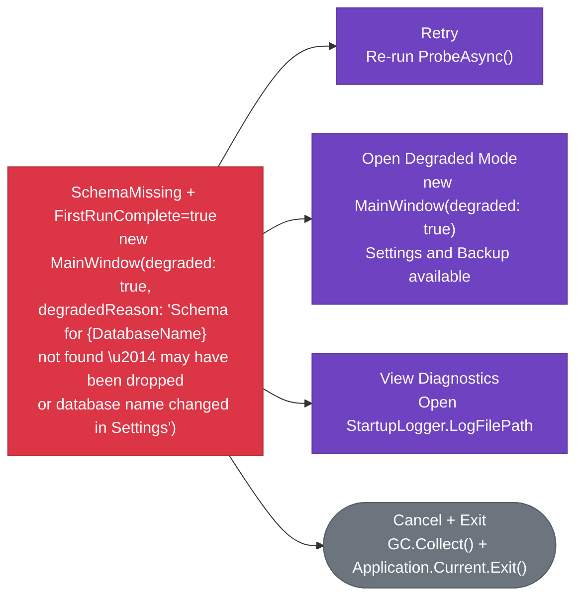

**Admin user missing — during setup** *(NoAdminUser + FirstRunComplete=false)*
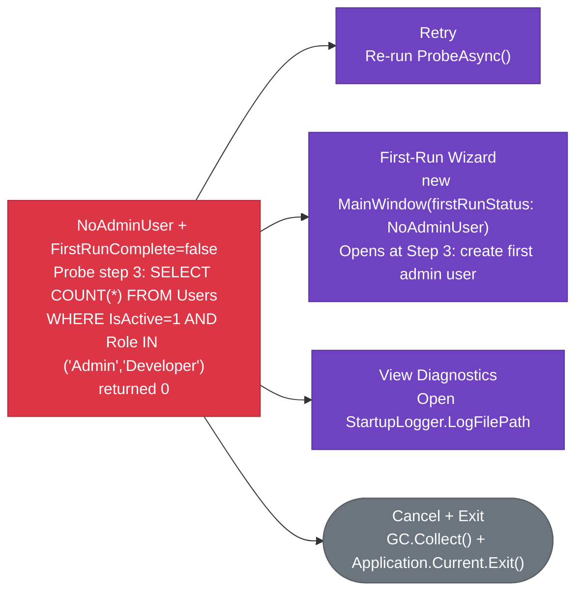

**Admin user missing — post setup** *(NoAdminUser + FirstRunComplete=true — account deleted/disabled)*

**API host failed** *(apiHost.Start() threw — app continues without API)*
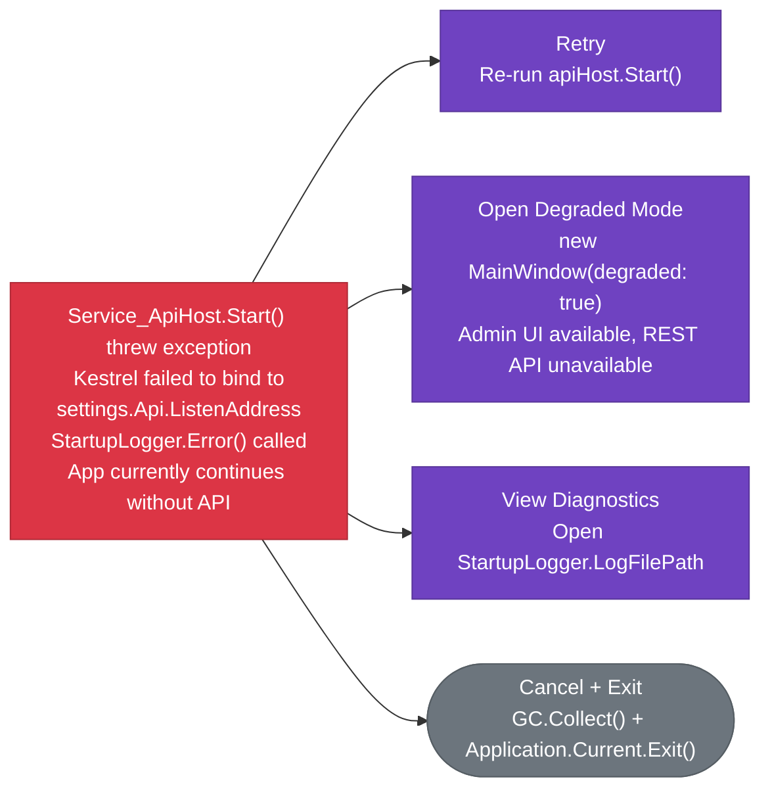

**Background service warning** *(BackupSchedulerService.StartAsync() error — non-blocking)*
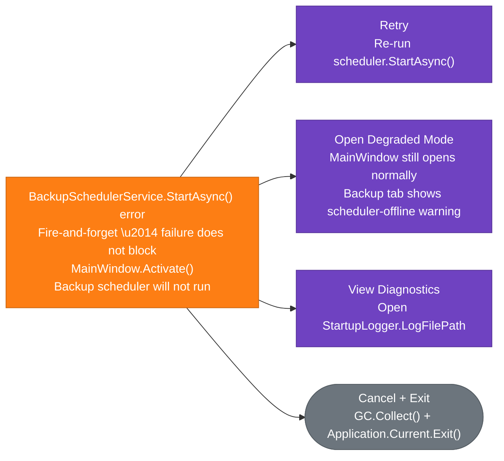

## What Changes From The Current Startup

### Current behavior (before splash work)

- All startup decisions run synchronously inside `App.OnLaunched()` before the user sees any UI.
- `RegisterSharedServices()` + `BuildServiceProvider()` — no window visible.
- `settingsStore.Get()` file read — no window visible.
- `firstRunService.ProbeAsync()` MySQL round trip — no window visible. On a slow network this can take the full `ConnectionTimeout` seconds (default 15s) with no feedback.
- `IsAuthorisedAsync()` second MySQL round trip on the Ready path — no window visible.
- `apiHost.Start()` Kestrel bind — no window visible.
- First window that appears is already `MainWindow` in its final mode (normal / degraded / wizard / access-denied).
- Failure routing is implicit in startup branches; the user has no choices and sees no intermediate state.

### Planned behavior (after splash work)

- `SplashWindow` activates first, before any blocking work begins.
- `Service_StartupCoordinator` runs all startup steps asynchronously, reporting progress to `ViewModel_Splash` via `IProgress<StartupStep>`.
- Each step updates a friendly status message on the splash.
- The probe timeout (up to 15s) is visible as a progress step rather than a frozen launch.
- When any step fails, the splash transitions to an issue view with action buttons matching the failure type.
- On success, the splash fades out and `MainWindow` activates in the correct mode.
- Existing degraded-mode rules are preserved — the coordinator emits the same branch outcomes that `App.xaml.cs` currently emits; the splash just presents them visually.
- Cancel at any point runs `GC.Collect()` + `Application.Current.Exit()`.

## Startup Inputs Shown To The User

Startup-time user inputs that can appear in the planned flow:

- **Retry** — re-runs the full startup coordinator sequence from the beginning.
- **Open Settings** — navigates to `View_Settings` inside a lightweight settings-only window or inline panel so the user can correct host/port/credentials; returns to splash on close.
- **Open Wizard** — routes into `MainWindow` in first-run wizard mode when setup work is required.
- **Open Degraded Mode** — routes into `MainWindow` in degraded mode when existing degraded logic allows it.
- **View Diagnostics** — expands an inline log panel or opens `StartupLogger.LogFilePath`.
- **Cancel** — runs cleanup, triggers `GC.Collect()`, then calls `Application.Current.Exit()`.

## Implementation Notes

- The splash is server-admin specific in the first pass. WinUI client and Android can follow with app-specific step lists.
- `Service_StartupCoordinator` extracts the decision logic currently in `App.OnLaunched()`. `App.xaml.cs` becomes a thin launcher that activates `SplashWindow` and wires up coordinator events.
- The coordinator returns a `StartupOutcome` record that the splash uses to decide which `MainWindow` constructor to call.
- `ViewModel_Splash` must be `Transient` in DI (one instance per launch attempt).
- All coordinator steps run on a background thread; UI updates must be dispatched to the WinUI `DispatcherQueue`.
- `SplashWindow` owns a `DispatcherQueue` reference obtained via `DispatcherQueue.GetForCurrentThread()` called during `OnLaunched()` before any background work starts.
- `Service_StartupCoordinator` lives in the Admin host (`MTM_Waitlist_Server.Admin`) — it is not a shared Core service because it owns WinUI-specific orchestration.
- Window sizing for the splash: use `Service_WindowSizer` with a new `ApplySplashSize()` method (400×280px, centered). `SplashWindow` constructs its own `Service_WindowSizer` instance the same way `MainWindow` does.
- The splash XAML should use `MicaBackdrop` to match `MainWindow`.
